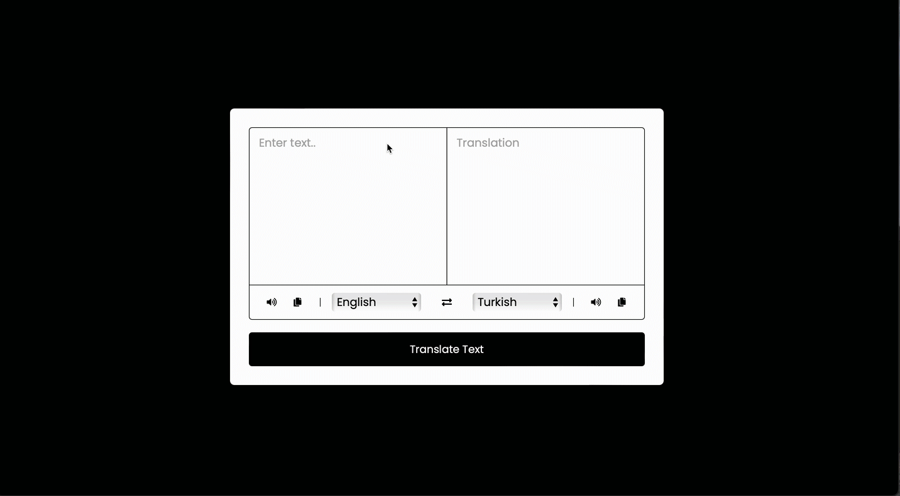

<h1>Language Translator</h1>

This Language Translator app enables users to translate text between various languages. Built with HTML, CSS, and JavaScript, it incorporates the MyMemory Translation API for accurate translations. The app supports multiple languages and includes features for text-to-speech and clipboard copying.

<h2>Features</h2>

<list>

- Instant Translation: Translate text between selected languages using the MyMemory Translation API.

- Language Selection: Choose source and target languages from a comprehensive list of options.

- Text-to-Speech: Listen to both the original and translated text using the browser's speech synthesis.

- Copy to Clipboard: Easily copy the text from either input or output fields with a click.

- Text Swapping: Swap source and target languages and their respective text with a single click.

</list>

<h2>Preview:</h2>

